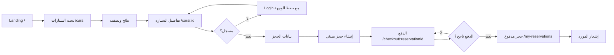
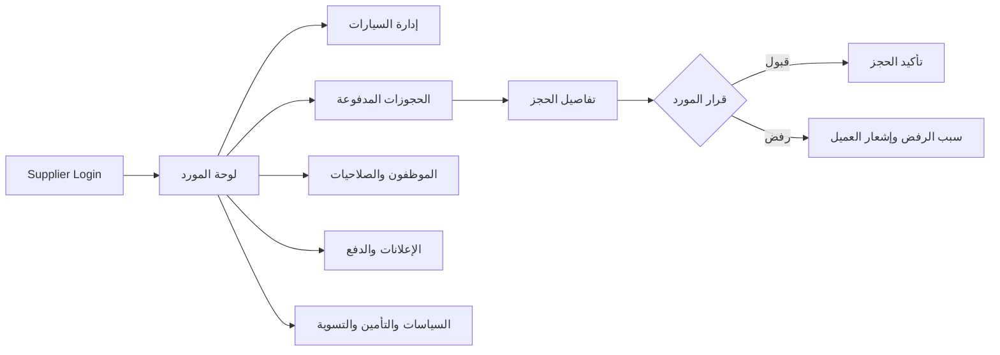
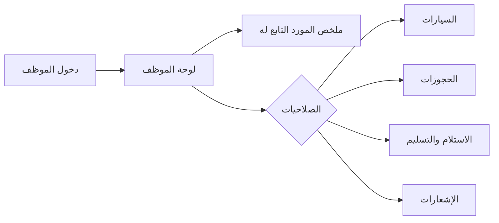
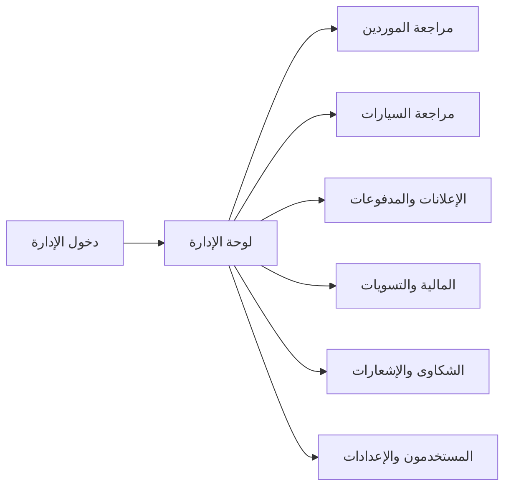

# تدقيق ترتيب الصفحات ورحلات المستخدم في منصة Rental Circle

## ملخص تنفيذي

أجريت مراجعة لبنية الواجهة ومسارات React ومكوّن التنقل العام ومسارات الـ API المرتبطة بالحجز والدفع والإعلانات والموظفين والإدارة. النتيجة الأساسية هي أن المشروع يحتوي على وظائف كثيرة، لكنه يحتاج إلى **توحيد نقطة الدخول، وتوحيد أسماء المسارات، وربط كل دور بلوحة عمل صحيحة، وإضافة حالات انتقال واضحة** حتى لا ينتقل المستخدم إلى صفحة لا تناسب هدفه أو يعود إلى الصفحة الرئيسية بلا تفسير.

المشكلة الأكبر ليست نقص الصفحات، بل وجود صفحات مكررة ومسارات متقاربة بأسماء مختلفة، إلى جانب خلل واضح في رابط لوحة الموظف داخل شريط التنقل العام. لذلك أوصي بعدم إضافة مزايا جديدة قبل تنفيذ طبقة تنظيم المسارات والرحلات الأساسية.

## 1. صورة البنية الحالية

### الصفحات العامة

| الوظيفة | المسار الحالي | الملاحظة |
|---|---|---|
| صفحة الهبوط | `/` | هي الصفحة التي تفتح عند بداية الموقع، وتستعمل `Landing.jsx`. |
| الصفحة الرئيسية الداخلية | `/home` | صفحة ثانية تؤدي معنى قريباً من الرئيسية، وهذا يسبب ازدواجية في نقطة الدخول. |
| السيارات | `/cars` | نقطة الدخول الأساسية للبحث والتصفية. |
| تفاصيل سيارة | `/cars/:id` و`/car/:id` | مساران لنفس الصفحة، ويجب اعتماد صيغة واحدة مع تحويل القديمة تلقائياً. |
| عن المنصة | `/about` | مسار عام صحيح. |
| تسجيل الدخول | `/login` | مستخدم لجميع الأدوار، بينما توجد صفحة مورّد منفصلة غير مستخدمة. |
| التسجيل | `/register` | يحتاج إلى تحديد واضح: عميل أم مورد أم اختيار الدور أولاً. |
| الانضمام كمورد | `/Vendor-Join` | اسم المسار غير موحّد في الكتابة، ويفضل `/supplier/join`. |
| فوائد المورد والمستأجر | `/supplier-benefits` و`/renter-benefits` | صفحات تسويقية، وينبغي أن تنتهي بزر واضح إلى المسار التالي. |

### صفحات العميل

| الوظيفة | المسار الحالي | الترتيب الصحيح |
|---|---|---|
| الحجوزات | `/my-reservations` | بعد الدخول أو من لوحة العميل. |
| الدفع | `/checkout/:reservationId` | لا يفتح إلا بعد إنشاء حجز مبدئي صالح، ثم يعود إلى تفاصيل الحجز بعد الدفع. |
| الملف الشخصي | `/profile` | ضمن حساب العميل. |
| الإعدادات | `/settings` | ضمن حساب العميل. |
| تفاصيل الإشعار | `/notifications/:id` | يجب أن تعرض تفاصيل كاملة ورابط الإجراء المرتبط بالإشعار. |
| المحادثة/الشكوى | `/complaints/:id` | يجب أن تكون مرتبطة بالحجز أو الطلب، لا مجرد صفحة مستقلة. |

### صفحات المورد

| الوظيفة | المسار الحالي | الملاحظة |
|---|---|---|
| لوحة المورد | `/supplier/dashboard` | يجب أن تكون نقطة الدخول الافتراضية للمورد بعد تسجيل الدخول. |
| سياراتي | `/supplier/cars` | صحيحة، وتحتاج زر إضافة واضحاً وحالة فراغ واضحة. |
| إضافة سيارة | `/supplier/cars/add` | صحيحة. |
| تعديل سيارة | `/supplier/cars/edit/:id` | صحيحة. |
| حجوزات المورد | `/supplier/reservations` | صحيحة، ويجب أن تعرض الحالات بتسلسل واضح. |
| تفاصيل الحجز | `/supplier/reservations/:id` | يجب أن تحتوي على قرار قبول/رفض وسبب الرفض ومعلومات الدفع والاستلام. |
| إعدادات المورد | `/supplier/settings` | يجب أن تشمل السياسات والتأمين والتسوية والإشعارات. |
| الموظفون | `/supplier/employees` | المسار المعتمد المقترح. |
| قائمة الموظفين القديمة | `/supplier/EmployeeList` | نسخة مكررة بحروف كبيرة يجب تحويلها للمسار القياسي. |
| نموذج الموظف القديم | `/supplier/EmployeeForm` | نسخة مكررة يجب تحويلها للمسار القياسي مثل `/supplier/employees/new`. |
| تفاصيل موظف | `/pages/supplier/employees/:id` | مسار غير منطقي لأنه يبدأ بـ`/pages`، ويجب استبداله بـ`/supplier/employees/:id`. |
| طلب إعلان | `/supplier/advertisement-request` و`/supplier/AdvertisementRequest` | يجب اعتماد مسار واحد فقط. |
| دخول المورد | `/supplier/login` | حالياً يعرض `Login.jsx` العام، بينما توجد `supplier/Login.jsx` غير مستخدمة. |

### صفحات الموظف

| الوظيفة | المسار الحالي | الملاحظة |
|---|---|---|
| لوحة الموظف | `/employee/dashboard` | المسار موجود ومحمي، لكن شريط التنقل العام لا يرسل الموظف إليه. |
| بيانات الموظف | `/api/employee-self/me/overview` و`/me/permissions` | منطق الصلاحيات موجود في الخلفية ويجب عكسه بصرياً في لوحة الموظف. |
| السيارات والحجوزات | `/api/employee-self/me/cars` و`/me/reservations` | يجب عدم إظهارها إلا حسب الصلاحية الفعلية، وليس حسب الدور فقط. |

### صفحات الإدارة

| الوظيفة | المسار الحالي | الملاحظة |
|---|---|---|
| لوحة الإدارة | `/admin/dashboard` | نقطة الدخول الصحيحة للإدارة. |
| المستخدمون | `/admin/users` | صحيحة. |
| السيارات | `/admin/cars` | صحيحة. |
| الشكاوى | `/admin/complaints` | صحيحة. |
| مركز الإعلانات | `/admin/advertisement-center` و`/admin/advertisementCenter` | يجب اعتماد المسار ذي الشرطة فقط. |
| إعلانات قديمة | `/admin/advertisements` | يبدو كصفحة مختلفة أو قديمة، ويجب تحديد هل هي مكتبة الإعلانات أم حذفها. |
| المالية | `/admin/finance` | صحيحة، لكنها تحتاج رابطاً واضحاً من لوحة الإدارة. |
| الإعدادات | `/admin/settings` | صحيحة. |
| طلبات الموردين | `/admin/supplier-requests` | صحيحة. |

## 2. الرحلات الصحيحة المقترحة

### رحلة الزائر والعميل

القاعدة المهمة هنا هي أن **الحجز لا ينتقل للمورد قبل نجاح الدفع**. يجب أن تظل هذه القاعدة واضحة في الواجهة، مع عرض حالة مثل «بانتظار إكمال الدفع» فقط داخل رحلة العميل، وليس كطلب متاح للمورد.

### رحلة المورد

### رحلة الموظف

يجب أن يرى الموظف فقط ما تسمح به صلاحياته في قاعدة البيانات. لا يكفي حماية المسار بدور `employee`، بل يجب تعطيل أو إخفاء الأقسام التي لا يملك الموظف صلاحيتها وإظهار رسالة مفهومة عند محاولة الوصول المباشر.

### رحلة الإدارة

## 3. العيوب الحالية حسب الأولوية

### أولوية حرجة

| العيب | الدليل في المشروع | الأثر |
|---|---|---|
| رابط الموظف خاطئ في شريط التنقل | `Navbar.jsx`، الدالتان `getDashboardLink` و`getDashboardText` تعالجان admin وsupplier فقط، وتعيدان للموظف `/my-reservations` و«حجوزاتي». | الموظف يسجل الدخول ثم يذهب إلى وجهة عميل أو لا يرى لوحة عمله. |
| ازدواجية نقطة الدخول | `/` يعرض `Landing` و`/home` يعرض `Home`، بينما يعرض شريط التنقل الرابطين معاً. | المستخدم لا يعرف أيهما الرئيسية وأيهما المنصة. |
| مسارات مكررة وغير موحدة | تفاصيل السيارة، الإعلانات، الموظفون، مركز الإدارة لها مسارات بحروف كبيرة أو صياغات متعددة. | روابط قديمة ومشاركة روابط غير ثابتة وصعوبة في الاختبار. |
| عدم وجود حفظ للوجهة بعد تسجيل الدخول | `PrivateRoute` يحوّل إلى `/login` دون تمرير `location.pathname` أو `state`. | المستخدم يفقد صفحة السيارة أو الدفع التي كان يريد الوصول إليها. |
| حماية المسارات لا تعالج حالة التحميل | `PrivateRoute` يعتمد مباشرة على `token` و`user` دون حالة تهيئة واضحة. | احتمال إعادة توجيه المستخدم إلى تسجيل الدخول أثناء استعادة الجلسة من التخزين. |

### أولوية عالية

| العيب | الأثر |
|---|---|
| وجود صفحة `supplier/Login.jsx` غير مستخدمة مع مسار المورد الذي يعرض تسجيل الدخول العام. | تجربة دخول المورد لا تعكس شروط المورد أو حالة اعتماد الحساب. |
| شريط التنقل العام يعرض نفس الروابط لجميع الأدوار. | المورد والموظف والإدارة يرون روابط عامة أكثر من روابط العمل الفعلية. |
| لا توجد لوحة عميل مستقلة؛ رابط لوحة العميل يظهر باسم «حجوزاتي». | العميل لا يملك مركزاً واضحاً للمدفوعات، المفضلة، الإشعارات، والحجوزات. |
| الإشعارات تستخدم Socket بعنوان ثابت `http://localhost:5000`. | تعمل محلياً فقط وقد تفشل على جهاز آخر أو في الإنتاج. |
| الإشعار ينتقل إلى `/notifications/:id`، لكن يجب التأكد من أن تفاصيل الإشعار تعرض الإجراء المرتبط مثل الحجز أو الإعلان أو الشكوى. | الإشعار قد يصبح صفحة معلومات بلا خطوة تالية. |
| مسارات الـ API مقسمة بين `/api/employee` و`/api/employees` لنفس مفهوم الموظفين. | صعوبة في معرفة المسار الصحيح وزيادة احتمالات أخطاء 404/500. |
| المالية محمية للإدارة فقط. | لا توجد واجهة واضحة للعميل لسجل الدفع أو للمورد لمعرفة المستحقات والتسويات. |

### أولوية متوسطة

| العيب | الأثر |
|---|---|
| استخدام أسماء مسارات تبدأ بحرف كبير مثل `/Vendor-Join` و`/supplier/EmployeeForm`. | عدم اتساق مع convention الويب، وقد يسبب مشاكل عند النشر على أنظمة حساسة لحالة الأحرف. |
| وجود `AuthProvider` في `main.jsx` مع استخدام Zustand في `App.jsx`. | مصدران محتملان للحالة، مما يزيد تعقيد التهيئة والصيانة. |
| الاعتماد على `window.prompt` لسبب رفض الإعلان في لوحة الإدارة. | تجربة غير احترافية ولا توفر تحققاً أو تاريخاً واضحاً للملاحظة. |
| عدم وجود صفحة 404 مخصصة؛ أي مسار غير معروف يعيد المستخدم إلى `/`. | المستخدم لا يعرف أن الرابط غير صحيح وقد يظن أن بياناته اختفت. |
| صفحات الإدارة والمورد والموظف لا تظهر منطقياً في قائمة جانبية موحدة. | المستخدم يصل لبعض الوظائف فقط عبر روابط داخلية متفرقة. |

## 4. الترتيب المقترح للقائمة والتنقل

### القائمة العامة قبل تسجيل الدخول

ينبغي أن تحتوي على: **الرئيسية، استئجار سيارة، كيف تعمل المنصة، عن المنصة، انضم كمورد، دخول، إنشاء حساب**. يجب دمج `/` و`/home` في تجربة واحدة، وعدم عرض «الرئيسية» و«المنصة» كرابطين متنافسين.

### قائمة العميل بعد تسجيل الدخول

ينبغي أن تحتوي على: **الرئيسية، استئجار سيارة، حجوزاتي، مدفوعاتي، الإشعارات، المفضلة، الملف الشخصي، الإعدادات**. ويجب أن تكون الوجهة الافتراضية للعميل `/customer/dashboard` أو `/my-reservations` بصورة مؤقتة إلى حين بناء لوحة عميل كاملة.

### قائمة المورد

ينبغي أن تكون لوحة المورد هي مركز العمل، وتحتوي على: **نظرة عامة، السيارات، الحجوزات، طلبات الإعلانات، الموظفون والصلاحيات، السياسات والتأمين، المالية والتسويات، الإشعارات، الإعدادات**.

### قائمة الموظف

ينبغي أن تحتوي على: **الرئيسية، ملخص العمل، السيارات المسموح بها، الحجوزات المسموح بها، الاستلام والتسليم، الإشعارات، الملف الشخصي**. يجب توليد العناصر من الصلاحيات التي تعود من `/api/employee-self/me/permissions` بدلاً من قائمة ثابتة.

### قائمة الإدارة

ينبغي أن تحتوي على: **لوحة الإدارة، المستخدمون، الموردون وطلبات الانضمام، السيارات، الحجوزات، الإعلانات، المالية، الشكاوى، واتساب، الإعدادات**.

## 5. الخطة التنفيذية ذات الأولوية

### المرحلة الأولى: إصلاح الملاحة الحرجة

يجب أولاً إصلاح `getDashboardLink` للموظف، وإضافة حفظ الوجهة الأصلية في `PrivateRoute`، ومنع إعادة التوجيه المبكر أثناء تحميل حالة المصادقة. بعد ذلك يتم اعتماد مسار قياسي واحد لكل وظيفة وإضافة تحويلات للمسارات القديمة بدلاً من حذفها مباشرة.

### المرحلة الثانية: توحيد المسارات

المسارات المقترحة هي: `/`, `/cars`, `/cars/:id`, `/login`, `/register`, `/supplier/join`, `/customer/dashboard`, `/customer/reservations`, `/customer/payments`, `/supplier/dashboard`, `/supplier/cars`, `/supplier/reservations`, `/supplier/employees`, `/supplier/employees/new`, `/supplier/employees/:id`, `/supplier/advertisements/new`, `/employee/dashboard`, `/admin/dashboard`, `/admin/advertisements`, `/admin/finance`.

المسارات القديمة مثل `/car/:id` و`/supplier/EmployeeList` و`/admin/advertisementCenter` يجب أن تعمل مؤقتاً كـ`Navigate` إلى المسارات الجديدة حتى لا تنكسر الروابط المحفوظة.

### المرحلة الثالثة: بناء تخطيط مشترك لكل دور

بدلاً من وضع كل الروابط في `Navbar.jsx`، ينبغي إنشاء تخطيطات مستقلة: `CustomerLayout`, `SupplierLayout`, `EmployeeLayout`, و`AdminLayout`. يبقى شريط الموقع العام للصفحات العامة فقط، بينما تستخدم لوحات العمل Sidebar أو Header خاصاً بالدور.

### المرحلة الرابعة: إكمال الرحلة المالية والحجز

يجب أن تكون رحلة العميل واضحة بصرياً: بحث، تفاصيل، بيانات حجز، دفع، تأكيد، متابعة الحالة. ويجب أن يرى المورد فقط الحجوزات التي اجتازت الدفع، بينما يرى العميل حالة الدفع وحالة قرار المورد في شاشة واحدة.

### المرحلة الخامسة: ربط الإشعارات بالإجراءات

كل إشعار يجب أن يحتوي على `entity_type` و`entity_id` أو رابط داخلي موثوق. عند فتح إشعار حجز ينتقل العميل إلى تفاصيل الحجز، وعند فتح إشعار إعلان ينتقل المورد إلى تفاصيل الطلب، وعند فتح إشعار موظف ينتقل المورد إلى ملف الموظف أو قرار التفعيل.

## 6. معايير قبول الإصلاح

| الاختبار | النتيجة المطلوبة |
|---|---|
| تسجيل دخول موظف | ينتقل إلى `/employee/dashboard` وليس `/my-reservations`. |
| تسجيل دخول مورد | ينتقل إلى `/supplier/dashboard`. |
| تسجيل دخول مدير | ينتقل إلى `/admin/dashboard`. |
| تسجيل دخول عميل | ينتقل إلى لوحة العميل أو الحجوزات. |
| فتح سيارة ثم تسجيل الدخول | يعود المستخدم إلى نفس تفاصيل السيارة بعد الدخول. |
| فتح الدفع دون حجز | تظهر صفحة رفض واضحة أو يعاد المستخدم إلى الحجوزات، وليس صفحة بيضاء. |
| استخدام مسار قديم | يتم التحويل إلى المسار القياسي دون فقدان المعرف. |
| موظف بلا صلاحية | يرى رسالة مفهومة أو صفحة ممنوعة، ولا يرى بيانات خارج نطاق المورد. |
| إشعار حجز | يفتح تفاصيل الحجز المرتبط. |
| فتح المنصة من جهاز آخر | يعمل Socket والإشعارات باستخدام عنوان بيئة صالح، لا `localhost` ثابتاً. |
| شاشة الهاتف | القائمة تحتوي على روابط الدور الحالي، ولا تخلط بين العميل والمورد والموظف. |

## الخلاصة

المنصة لا تحتاج في هذه المرحلة إلى صفحات أكثر بقدر حاجتها إلى **نظام تنقل موحّد ومفهوم**. أعلى إصلاحين تأثيراً هما إصلاح وجهة الموظف بعد تسجيل الدخول، ودمج `/` و`/home` في نقطة دخول واحدة. بعدهما يأتي توحيد مسارات الموظفين والإعلانات ومركز الإدارة، ثم فصل تخطيط كل دور عن شريط التنقل العام.

الترتيب المقترح للتنفيذ هو: **المصادقة والوجهات، ثم توحيد المسارات، ثم تخطيطات الأدوار، ثم ربط الحجز والدفع، ثم الإشعارات، ثم التحسينات البصرية**. هذا الترتيب يمنع إضافة تصميمات جديدة فوق تدفق تنقل غير مستقر.

## مراجع المشروع

1. [frontend/src/App.jsx](frontend/src/App.jsx) — تعريف مسارات الواجهة وحمايتها.
2. [frontend/src/components/Navbar.jsx](frontend/src/components/Navbar.jsx) — شريط التنقل والوجهات حسب الدور والإشعارات.
3. [frontend/src/main.jsx](frontend/src/main.jsx) — تهيئة React والمصادقة عند بدء التطبيق.
4. [backend/src/routes/reservationRoutes.js](backend/src/routes/reservationRoutes.js) — مسارات دورة الحجز.
5. [backend/src/routes/paymentRoutes.js](backend/src/routes/paymentRoutes.js) — مسارات العملات والدفع وسجل المدفوعات.
6. [backend/src/routes/employeeSelfRoutes.js](backend/src/routes/employeeSelfRoutes.js) — صلاحيات الموظف ونطاق بياناته.
7. [backend/server.js](backend/server.js) — ربط مسارات الـ API في الخادم.
